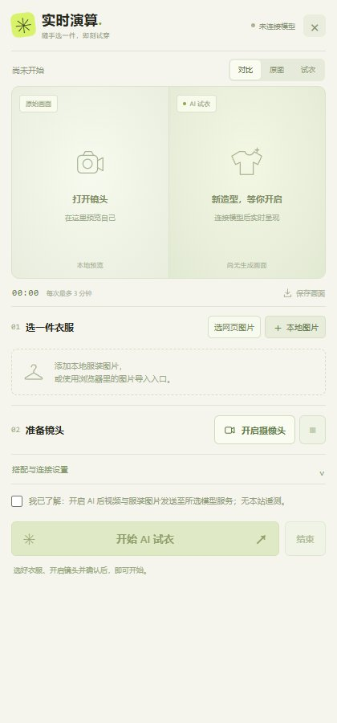

# 实时演算

**随浏览器调出的实时试衣插件 · 0.1.0 开发原型**

浏览商品时，点浏览器扩展图标，就在当前网页旁打开试衣面板。选服装、打开镜头、确认云端处理后连接模型；结束时关闭摄像头与连接。默认入口不会创建独立网站或新标签页。



实际生成接入 Decart 官方 `lucy-vton-3.5`，需要使用者自己的 API 密钥和额度。**没有训练自有试衣模型，也没有验证效果或延迟超过 Anywear。真人摄像头、付费模型和手机端到端试衣尚未验收。**

## 电脑、安卓和 iPhone

- **电脑 Edge / Chrome**：点击工具栏图标打开侧边面板；网页图片右键菜单也可唤起。使用 `dist/`。
- **安卓 Firefox**：准备了扩展弹层开发包 `dist-mobile-firefox/`，从浏览器扩展菜单调用。未签名、未在 Android 真机验证。
- **iPhone Safari**：准备了扩展弹层源包 `dist-mobile-safari/`，需 Apple 打包、签名和安装。未提供已签名安装包，未在 iPhone 真机验证。

手机和电脑共享紧凑面板。手机浏览器的 popup 可能随关闭或切换而卸载，不能承诺跨页面持续视频。各平台安装与验证步骤见 [手机说明](docs/mobile.md)。这是对指定浏览器的适配，不代表所有手机浏览器均支持扩展。

## 使用流程

1. 打开商品网页，再点扩展图标。
2. 点“选网页图片”，查看当前页面已加载图片的名称和尺寸，选择一张并确认导入；也可添加本地图片。电脑还支持在图片上右键选择“在实时演算中试穿”。
3. 点击“开启摄像头”先看本地预览，此时不连接生成模型、不录音。
4. 勾选云端处理确认，点击“开始 AI 试衣”。视频和所选服装发送给模型服务。
5. 在当前衣橱切换服装，查看原图/试衣/对比，或保存实际收到的生成画面。
6. 点击“结束”或面板关闭控件，停止摄像头与连接。

每次最多 6 张图片、单张 8 MB；只存于当前面板内存。网页选图只在主动点击后执行，无常驻全站内容脚本。导入图片时按来源申请权限，不携带 Cookie/Referer，不跟随重定向。最多运行 3 分钟，连接超时 45 秒；隐藏超过 15 秒自动停止，页面卸载立即清理媒体。

帧率和延迟仅使用实际 SDK 数据；未收到远程视频时不显示伪造结果。健康检查也不代表账户额度与生成成功。

## 构建和电脑安装

需要 Node.js 22.12+ 和桌面 Chrome 116+ 或兼容的 Edge。

```bash
git clone https://github.com/kkun72045-jpg/share-my-ider.git
cd share-my-ider
npm ci
npm run build
```

构建生成电脑包 `dist/`、Firefox 手机开发包 `dist-mobile-firefox/`、Safari 手机开发源包 `dist-mobile-safari/`。后两者生成成功不代表真机兼容或商店审核通过。

在 `edge://extensions/` 或 `chrome://extensions/` 开启开发者模式，选择“加载解压缩的扩展”，选中 `dist/`。固定插件图标后点击，侧边面板会随当前网页打开。

将 `.env.example` 复制为 `.env`，在本机填写：

```dotenv
DECART_API_KEY=自己的官方模型密钥
ALLOWED_EXTENSION_ID=电脑扩展来源最后的32位ID
PORT=8787
```

模型密钥从 [Decart 官方平台](https://platform.decart.ai/) 获取；仅写在服务端 `.env`，不填写在插件里。服务费用以提供方为准。

```bash
npm run broker
```

保持服务运行。在面板“搭配与连接设置”里保留 `http://127.0.0.1:8787`，点“检查连接”，再按使用流程操作。未配置访问码的默认电脑本机服务不需要填访问码。

## 手机凭证服务

手机的 `127.0.0.1` 指向手机自己。手机需填写你自己的 **HTTPS 凭证服务域名和独立访问码**；模型长期密钥仍留在服务器。已实现精确扩展来源白名单、访问码验证、限速和短期凭证签发，但本仓库没有替你部署远程服务。

服务端配置 `ALLOWED_EXTENSION_ORIGINS` 与至少 32 字符的 `BROKER_ACCESS_TOKEN`，然后通过 HTTPS 反向代理访问。详见 [服务配置](server/README.md)。访问码只在面板内存中使用，不写浏览器存储；关闭后需重新输入。当前配置适合个人测试，多用户上线仍需要账户、配额和运维设计。

## 开发与验证

```bash
npm test
npm run build
npm run dev
```

开发预览为 `http://127.0.0.1:5173/panel.html`，仅用于调试插件面板。预览中没有真实扩展入口或网页选图权限；正式检查应加载构建目录。连接本机服务时，需要 `.env` 显式设置对应 `DEV_ORIGIN`。

验证范围见 [验证记录](docs/verification.md)，设计与后续改进见 [设计说明](docs/design.md)。当前没有自动服装抠图、3D 体型建模、精确尺码预测或离线推理；生成效果仅供搭配参考。受登录限制、跨站限制、重定向或不支持格式影响，网页图片可能无法导入，可改用本地文件。

停止本地连接与服务端结算不一定同时完成。时限保护不构成零费用或退款保证。构建附带 `LICENSE` 和 `THIRD_PARTY_NOTICES.txt`，许可证不包含模型权重、服务额度或第三方品牌权利。

官方资料：[SDK](https://github.com/DecartAI/sdk)、[短期凭证](https://docs.platform.decart.ai/getting-started/client-tokens)、[实时试衣模型](https://platform.decart.ai/models/lucy-vton)、[Chrome 侧边面板](https://developer.chrome.com/docs/extensions/reference/api/sidePanel)。
